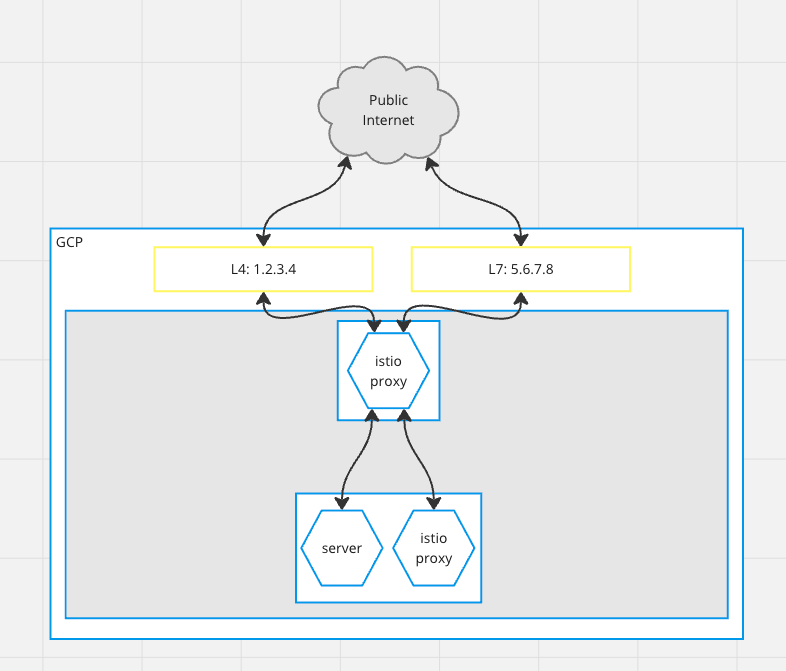

# Google L7 load balancing issue reproduction attempt

This is a minimal gRPC streaming demo. The server is in `src/dotnet/LbIssue.ApiHost`, and listens on:
* `5001` - HTTP/1.1, used for the `GET /send` method for sending messages
* `5002` - HTTP/2, the gRPC endpoint that the client connects to

The `src/dotnet/LbIssue.Client` is a command-line app that we can `dotnet run -- https://url.to.deployment` to
set up a stream listener.

## Infrastructure Setup

The L4 load balancer was created by the `istio-ingressgateway` `Service` which is of type `LoadBalancer`. The
L7 load balancer was created by a GKE `Ingress`. Both GCP load balancers point to the `istio-ingressgateway`
`Service` that's deployed on the GKE cluster.

Istio has a `Gateway` configured to listen on port 443 for HTTPS traffic. The `VirtualService` is what routes
traffic to the right port based on the hostname.

This architecture is the same as the one referenced [here](https://cloud.google.com/architecture/exposing-service-mesh-apps-through-gke-ingress#cloud_ingress_and_mesh_ingress).